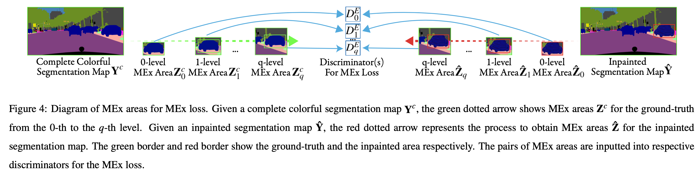
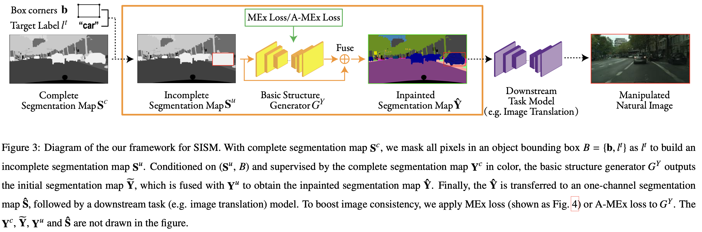

# Code Introduction
This is the code for *Neurocomputing 2022* paper [Semantic Inpainting on Segmentation Map via Multi-Expansion Loss](https://www.sciencedirect.com/science/article/abs/pii/S0925231222007433)

Folder `AMEx_Loss` includes key files for AMEx loss on natural image inpaitning.

Comparing with MEx loss, AMEx loss uses an image in full size but masks its different-size parts as 0; AMEx uses only one discriminator.

Folder `semantic_editing` includes the implementation of 3-channel SISM task. 
It includes both MEx loss and AMEx loss on SISM.
It does not include downstream tasks, which uses the SISM output as input in a downstream task(e.g. image translation task, semantic image inpainting...).

## AMEx Loss on natural image processing
The AMEx Loss is implmented in `AMEx_Loss/net_gl_mex.py-> _netlocalD`. 

The original Global and Local GAN loss is in `AMEx_Loss/net_gl.py-> _netlocalD`.

The `AMEx_Loss/MyTrain` includes how the AMEx is used in the optimizer.

## AMEx Loss & MEx Loss on Semantic Inpainting on Segmentation Map (SISM)

The environment is in `semantic_editing/py35pt04.yaml`.

### For cityscape

For Pipeline,

`python MyTrain.py --name lable2city_128p_Full_NonMultiExp --model MyBasePix2PixHDModel --is_scGraph 1 --label_nc 36 --dataroot ./datasets2/cityscapes/ --is_shapePrior 0 --is_scGraph 3 --niter 100 --niter_decay 100 --ImageFileEnd _img2labelcolor --MultiExpanTimes 0 --MultiExpanRadius 5 --gpu_ids 0 --loadSize 256 --fineSize 128 --labmdaShape 1 --labmdaMulExp 1`

For Pipeline + MEx Loss,

`python MyTrain.py --name cityscape_OnlyMultiExp4_newcolor --model MyBasePix2PixHDModel --is_scGraph 1 --label_nc 36 --dataroot ./datasets2/cityscapes/ --is_shapePrior 0 --is_scGraph 3 --niter 100 --niter_decay 100 --ImageFileEnd _img2labelcolor --MultiExpanTimes 4 --MultiExpanRadius 5 --gpu_ids 0 --loadSize 256 --fineSize 128 --labmdaShape 1 --labmdaMulExp 1`

For Pipeline + AMEx Loss,

`python MyTrain.py --name lable2city_128p_Full_OnlyMultiEx_Approx --model MyBasePix2PixHDModel --is_scGraph 1 --label_nc 36 --dataroot ./datasets2/cityscapes/ --is_shapePrior 0 --is_scGraph 3 --niter 100 --niter_decay 100 --ImageFileEnd _img2labelcolor --MultiExpanTimes 4 --MultiExpanRadius 5 --gpu_ids 0 --loadSize 256 --fineSize 128 --labmdaShape 1 --labmdaMulExp 1 --MEx_approx`

For evaluation (replace `--name` by a trained model name):

`python MyTest_backup_0902.py --Te --name lable2city_128p_Full_OnlyMultiEx_Approx --model MyBasePix2PixHDModel --which_epoch 200 --netG generator_from_SPADE --is_scGraph 3 --label_nc 36 --dataroot ./datasets2/cityscapes/ --ImageFileEnd _img2labelcolor --how_many 501 --gpu_ids 0 --is_shapePrior 0 --is_ClassiForShape 0 --loadSize 256 --fineSize 128`

